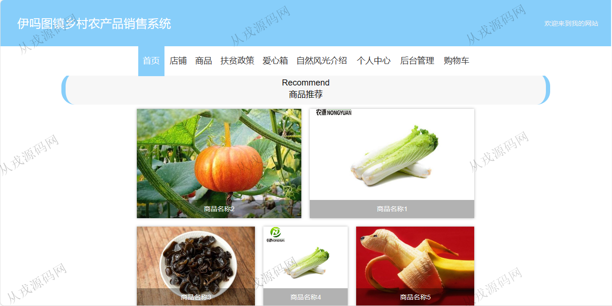
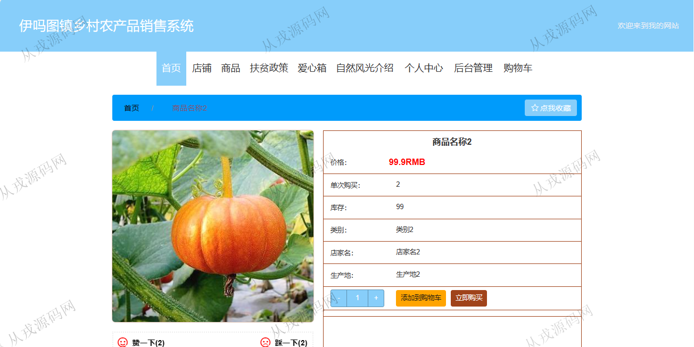
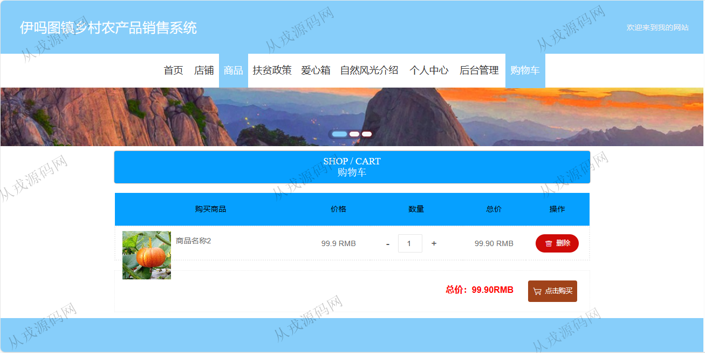
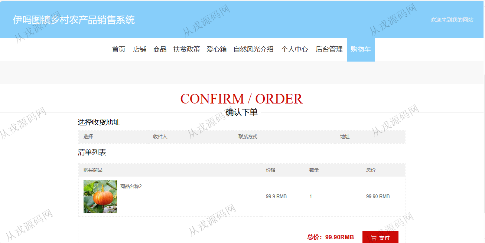
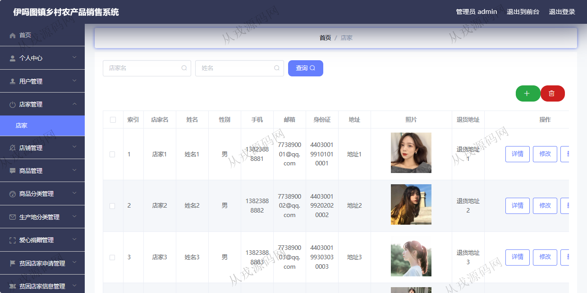
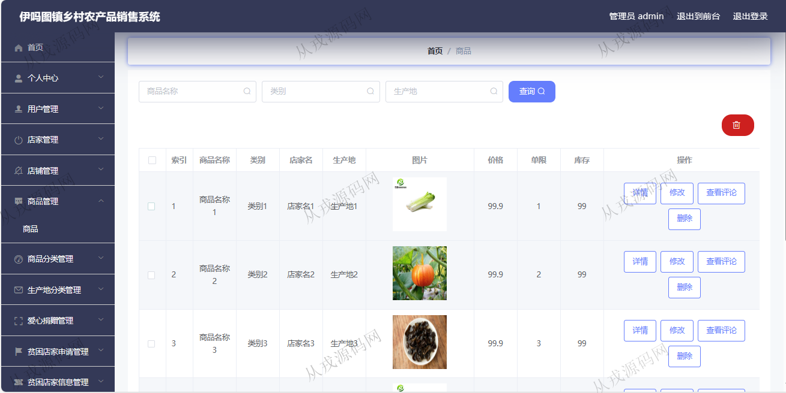
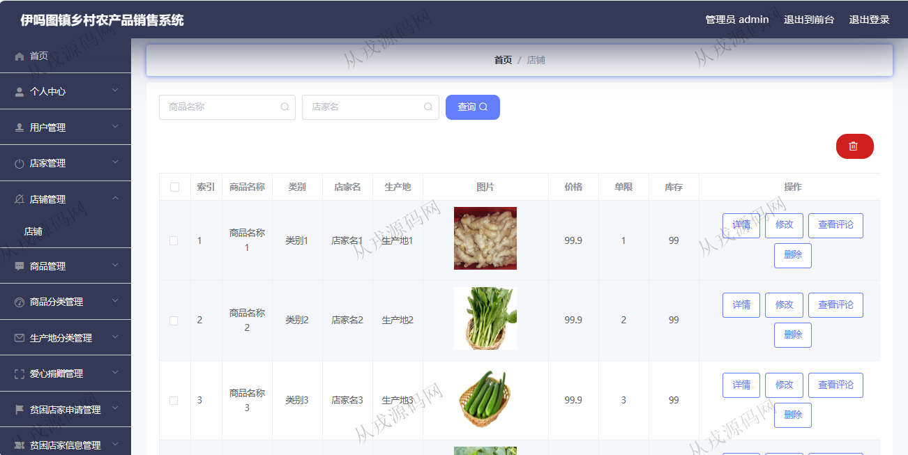
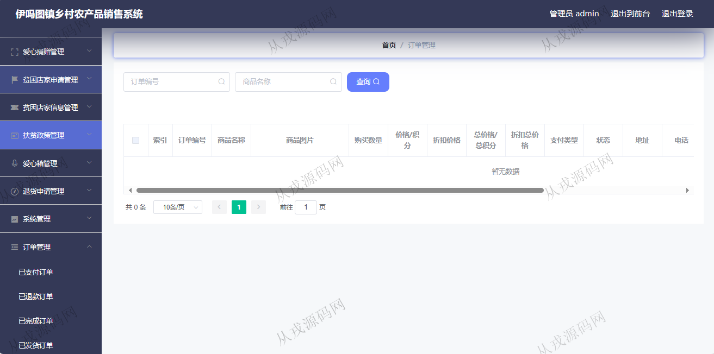

<h1 align="center">224.乡村农产品销管理系统</h1>

- <b>完整代码获取地址：从戎源码网 ([https://armycodes.com/](https://armycodes.com/))</b>
- <b>技术探讨、资料分享，请加QQ群：692619798</b> 
- <b>作者微信：19941326836  QQ：952045282</b> 
- <b>承接计算机毕业设计、Java毕业设计、Python毕业设计、深度学习、机器学习</b>
- <b>选题+开题报告+任务书+程序定制+安装调试+论文+答辩ppt 一条龙服务</b>
- <b>所有选题地址 ([https://github.com/YuLin-Coder/AllProjectCatalog](https://github.com/YuLin-Coder/AllProjectCatalog)) </b>

## 项目介绍
基于springboot+vue的乡村农产品销管理系统：前端 vue2、elementui，后端 maven、springmvc、spring、mybatis；角色分为管理员、用户；集成商品浏览、购物车、商品结算、在线支付等功能于一体的系统。

## 功能介绍

### 用户

- 基本功能：登录，注册，退出
- 网站首页：主导航栏，轮播图，商品推荐，扶贫政策展示
- 商品：商品列表展示，商品搜索，商品详情，购物车，结算，在线付款（模拟）
- 其它功能：店铺展示，扶贫政策，爱心箱，自然风光展示
- 个人中心：个人信息查看与修改，我的订单查询，我的地址，我的收藏

### 管理员

- 用户管理：用户在前台自行注册，管理员查看用户注册信息，也可以在后台增删改查
- 店铺管理：店铺信息的增删改查
- 商品管理：商品信息的增删改查，商品图片上传
- 商品分类管理：分类信息的增删改查
- 扶贫政策管理：扶贫政策信息的增删改查
- 订单管理：订单信息的列表查询，发货，退货处理

## 环境

- <b>IntelliJ IDEA 2021.3</b>

- <b>Mysql 5.7.26</b>

- <b>JDK 1.8</b>
 
- <b>node 14.14.0</b>

## 运行截图

